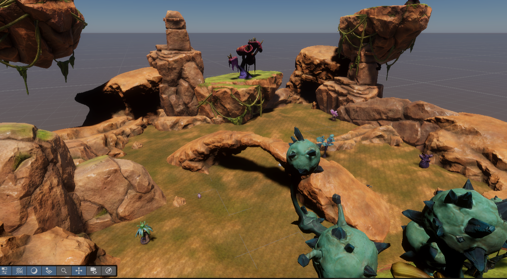

# Lost
__Game Project that is inspired by Expedition 33 [Expedition 33] (https://www.expedition33.com/)__



*Engine Configuration

|Engine|Version|
|------|-------|
|Unity|6000.1.2f1|

----
## Structure
The project is composed of the following major classes:

#### Player

The ```Player``` class has the following responsibilities:

* Input Handling

* Spawning and governing the View Camera

* Trigger the Battle Encounter

#### MovementController

The ```MovementController``` class governs the movement of the player character, it uses velocity and the ```CharacterController``` class to govern the movement of the character. It will handle:

* Movement

* Jump and Gravity

* Update the animation parameters

*Convert movement input to world dir:

```c#
Vector3 PlayerInputToWorldDir(Vector2 inputVal)
    {
        Vector3 rightDir = Camera.main.transform.right;
        Vector3 fwdDir = Vector3.Cross(rightDir, Vector3.up);

        return rightDir * inputVal.x + fwdDir * inputVal.y;
    }
```


